- [zoomstudentengagement](#zoomstudentengagement)
  - [Installation](#installation)
  - [Example](#example)
- [Steps to use
  zoomstudentengagement](#steps-to-use-zoomstudentengagement)
  - [1. Define Inputs:](#1-define-inputs)
  - [2. Load the zoomstudentengagement
    library](#2-load-the-zoomstudentengagement-library)
  - [3. Download the Zoom Recording
    Transcripts](#3-download-the-zoom-recording-transcripts)
  - [4. Load the list of Zoom Recordings
    Transcripts](#4-load-the-list-of-zoom-recordings-transcripts)
  - [5. Load Zoom Transcript files and Run Faculty Linguistic Inquiry
    and Word Count on those
    sessions.](#5-load-zoom-transcript-files-and-run-faculty-linguistic-inquiry-and-word-count-on-those-sessions)
- [Load Other Data](#load-other-data)
  - [1. Load Roster of Students from a CSV
    file](#1-load-roster-of-students-from-a-csv-file)
  - [2. Make the `sections_df` data frame of Class Sections from the
    Student
    Roster](#2-make-the-sections_df-data-frame-of-class-sections-from-the-student-roster)
  - [3. Make the `roster_small_df` data frame of the Student
    Roster](#3-make-the-roster_small_df-data-frame-of-the-student-roster)
  - [4. Make the `roster_sessions` data frame of the Student Roster With
    Rows for Each Recorded Class
    Section](#4-make-the-roster_sessions-data-frame-of-the-student-roster-with-rows-for-each-recorded-class-section)
- [Clean Names](#clean-names)
  - [1. Make Clean Names DF of joined student names from the roster and
    transcripts](#1-make-clean-names-df-of-joined-student-names-from-the-roster-and-transcripts)
  - [2. Write Section Names Lookup](#2-write-section-names-lookup)
  - [3. Make Names to Clean](#3-make-names-to-clean)
  - [4. Manually edit section_names_lookup.csv to clear names needing
    cleaning](#4-manually-edit-section_names_lookupcsv-to-clear-names-needing-cleaning)
  - [5. Repeat Step 1 as necessary until the only names left are
    intentionally unmatched to students on the
    roster.](#5-repeat-step-1-as-necessary-until-the-only-names-left-are-intentionally-unmatched-to-students-on-the-roster)
- [Results](#results)
  - [1. Make Transcripts Session
    Summary](#1-make-transcripts-session-summary)
    - [1B. Write Transcripts Session
      Summary](#1b-write-transcripts-session-summary)
  - [2. Make Transcripts Summary](#2-make-transcripts-summary)
    - [2B. Write Transcripts Summary](#2b-write-transcripts-summary)
  - [2. Plot Users by key metrics](#2-plot-users-by-key-metrics)
- [Students Only](#students-only)
  - [1. Make Transcripts Summary](#1-make-transcripts-summary)
  - [2. Plot Students by key metrics](#2-plot-students-by-key-metrics)
  - [3. Plot Students with names masked by key
    metrics](#3-plot-students-with-names-masked-by-key-metrics)
- [Student Reports](#student-reports)
  - [1. Make Transcripts Summary](#1-make-transcripts-summary-1)
  - [run_student_reports()](#run_student_reports)
    - [Run run_student_reports()](#run-run_student_reports)
- [`fliwc()` a single transcript file:](#fliwc-a-single-transcript-file)
  - [1. fliwc()](#1-fliwc)
- [Walkthrough of key steps in
  `fliwc()`](#walkthrough-of-key-steps-in-fliwc)
  - [1. load_zoom_transcript()](#1-load_zoom_transcript)
  - [2. process_zoom_transcript()](#2-process_zoom_transcript)
  - [3. fliwc()](#3-fliwc)
- [Steps to use
  zoomstudentengagement](#steps-to-use-zoomstudentengagement-1)
- [Old](#old)

<!-- README.md is generated from README.Rmd. Please edit that file -->

# zoomstudentengagement

<!-- badges: start -->
<!-- badges: end -->

The goal of `zoomstudentengagement` is to allow instructors to gain
insights into student engagement, with a particular focus on
participation equity, from Zoom transcripts of recorded course sessions.

In it’s current form, the `zoomstudentengagement` library is useful for
4 related things:

1.  **Load Zoom transcripts**
    1.  `load_zoom_transcript()` takes a Zoom transcript .vtt file and
        load it into a rectangular format without additions or
        modifications.
    2.  `process_zoom_transcript()` process a Zoom transcript with given
        parameters to get a tibble containing the comments, including
        consolidating consecutive comments from the same speaker and
        adding rows for “dead_air”.
2.  **Calculate summary metrics** by speaker from a Zoom recording
    transcript or transcripts
    1.  `fliwc()` calculates summary metrics by speaker from a Zoom
        recording transcript.
    2.  `fliwc_transcript_files()` calculates summary metrics by speaker
        from multiple Zoom recording transcripts.
3.  **Do some housekeeping** to load and clean the student roster.
    1.  `load_roster()` loads a Roster of Students from a CSV file
        (`roster.csv`)
    2.  `make_sections_df()` generates a tibble that includes rows for
        each section (grouped by dept and course number) and student
        count in each.
    3.  `make_roster_small()` gets a tibble that includes rows for each
        students enrolled in the class or classes, with a small subset
        of the roster columns.
    4.  `make_student_roster_sessions()` generates a tibble from the and
        list of transcript files.
    5.  Clean up the names in the transcript.
        1.  `make_clean_names_df()` joins the student names by section
            (from `make_student_roster_sessions()`) and the session
            details and transcript summary by speaker for all class
            sessions (from `fliwc_transcript_files()`).
        2.  `write_section_names_lookup()` saves a subset of the clean
            names df to a csv file so it can be updated manually.
        3.  `make_names_to_clean_df()` returns a tibble containing only
            the records in the clean names df that have transcript
            recordings but no matching student id (so they can be
            manually updated if necessary\_.
        4.  Manually edit the section names lookup csv to clear names
            needing cleaning.
        5.  Repeat Steps 1-4 as necessary until the only names left are
            intentionally unmatched to students on the roster.
4.  **Analyze results** across students/speakers to gain insights into
    student engagement, with a particular focus on participation equity.
    1.  `make_transcripts_session_summary_df()` returns a tibble from
        the cleaned names, and summarizes results at the level of the
        session and preferred student name.
    2.  `make_transcripts_summary_df()` returns a tibble from the
        summary metrics by student and class session (from
        `make_transcripts_session_summary_df()`) that summarizes results
        at the level of the class section and preferred student name.
    3.  `plot_users_by_metric()` outputs plots for the key metrics. This
        function needs to be run for each metric.

## Installation

You can install the development version of zoomstudentengagement like
so:

``` r
devtools::install_github("revgizmo/zoomstudentengagement")
```

## Example

This is a basic example which shows you how to solve a common problem:

``` r
library(zoomstudentengagement)
```

# Steps to use zoomstudentengagement

## 1. Define Inputs:

``` r
# data_folder_input <- 'data_201_2024_t1_spring'
# data_folder_input <- 'data_lft'

# library(zoomstudentengagement)
data_folder_input <- system.file("extdata",  package="zoomstudentengagement")


# data_folder_input <- 'data'

transcripts_folder_input <- "transcripts"
topic_split_pattern_input <- paste0(
  "^(?<dept>\\S+) (?<section>\\S+) - ",
  "(?<day>[A-Za-z]+) (?<time>\\S+\\s*\\S+) (?<instructor>\\(.*?\\))"
)
zoom_recorded_sessions_csv_names_pattern_input <- "zoomus_recordings__\\d{8}(?:\\s+copy\\s*\\d*)?\\.csv"
dept_input <- "LFT"
semester_start_mdy_input <- "Jan 01, 2024"
scheduled_session_length_hours_input <- 1.5


### roster_file
roster_file_input = 'roster.csv'
# roster_file used in load_roster()


### cancelled_classes_file
cancelled_classes_file_input <- 'cancelled_classes.csv'
# cancelled_classes_file used in load_cancelled_classes()


### names_lookup_file
names_lookup_file_input <- 'section_names_lookup.csv'
# names_lookup_file used in load_section_names_lookup(), make_clean_names_df()


### transcripts_session_summary_file_input
transcripts_session_summary_file_input <- 'transcripts_session_summary.csv'
# transcripts_session_summary_file_input used in write_transcripts_session_summary()


### transcripts_summary_file_input
transcripts_summary_file_input <- 'transcripts_summary.csv'
# transcripts_summary_file_input used in write_transcripts_summary()


### instructor_name_input
instructor_name_input = 'Conor Healy'
# instructor_name_input used in make_students_only_transcripts_summary_df()


### student_summary_report
student_summary_report_input <- 'Zoom Student Engagement Analysis - student summary report'
# student_summary_report used in run_student_reports()


cat(paste0("+ `data_folder_input`:  '", data_folder_input, "'\n", 
          "+ `transcripts_folder_input` = '", transcripts_folder_input, "'\n", 
          "+ `dept_input`: '", dept_input, "'\n", 
          "+ `semester_start_mdy_input`: '", semester_start_mdy_input, "'\n", 
          "+ `topic_split_pattern_input`: '", topic_split_pattern_input, "'\n", 
          "+ `zoom_recorded_sessions_csv_names_pattern_input`: '", zoom_recorded_sessions_csv_names_pattern_input, "'\n", 
          "+ `scheduled_session_length_hours_input`: '", scheduled_session_length_hours_input, "'\n", 
          "+ `roster_file_input`: '", roster_file_input, "'"
)
)
```

- `data_folder_input`:
  ‘/Library/Frameworks/R.framework/Versions/4.1-arm64/Resources/library/zoomstudentengagement/extdata’
- `transcripts_folder_input` = ‘transcripts’
- `dept_input`: ‘LFT’
- `semester_start_mdy_input`: ‘Jan 01, 2024’
- `topic_split_pattern_input`: ’^(?<dept>+) (?
  <section>
  +) - (?<day>\[A-Za-z\]+) (?<time>++) (?<instructor>$.*?$)’
- `zoom_recorded_sessions_csv_names_pattern_input`:
  ’zoomus_recordings\_\_(?:+copy?.csv’
- `scheduled_session_length_hours_input`: ‘1.5’
- `roster_file_input`: ‘roster.csv’

## 2. Load the zoomstudentengagement library

- `r devtools::install_github("revgizmo/zoomstudentengagement")`
- `r library(zoomstudentengagement)`

``` r
library(zoomstudentengagement)

# devtools::load_all('../zoomstudentengagement')
# devtools::install_github("revgizmo/zoomstudentengagement")
```

## 3. Download the Zoom Recording Transcripts

1.  Download Zoom csv file with list of recordings and transcripts
    1.  Go to <https://www.zoom.us/recording>
    2.  Export the Cloud Recordings
    3.  Copy the cloud recording csv (naming convention:
        ’zoomus_recordings\_\_\d{8}.csv’) to ‘data/transcripts/’
2.  Download Transcripts
    1.  Go to <https://www.zoom.us/recording>
    2.  Click on each individual record to go to the page for that
        recording
    3.  Download the Audio Transcript and Chat File for each
        - Chat: ’GMT\d{8}-\d{6}\_Recording.cc.vtt’
        - Transcript: ’GMT\d{8}-\d{6}\_Recording.transcript.vtt’
    4.  Copy the Audio Transcript and Chat Files to ‘data/transcripts/’

## 4. Load the list of Zoom Recordings Transcripts

1.  Run `load_zoom_recorded_sessions_list()` to get a tibble from a
    provided csv file of Zoom recordings.

``` r
zoom_recorded_sessions_df <- load_zoom_recorded_sessions_list(
  data_folder = data_folder_input,
  transcripts_folder = transcripts_folder_input,
  topic_split_pattern = topic_split_pattern_input,
  zoom_recorded_sessions_csv_names_pattern = zoom_recorded_sessions_csv_names_pattern_input,
  semester_start_mdy = semester_start_mdy_input,
  scheduled_session_length_hours = scheduled_session_length_hours_input
)
#> Rows: 4 Columns: 9
#> ── Column specification ────────────────────────────────────────────────────────
#> Delimiter: ","
#> chr (4): Topic, ID, Start Time, Last Accessed
#> dbl (4): File Size (MB), File Count, Total Views, Total Downloads
#> 
#> ℹ Use `spec()` to retrieve the full column specification for this data.
#> ℹ Specify the column types or set `show_col_types = FALSE` to quiet this message.

# getwd()
# zoom_recorded_sessions_df <- load_zoom_recorded_sessions_list(
#   data_folder = data_folder_input,
#   transcripts_folder = "transcripts",
#   topic_split_pattern = paste0(
#     "^(?<dept>\\S+) (?<section>\\S+) - ",
#     "(?<day>[A-Za-z]+) (?<time>\\S+\\s*\\S+) (?<instructor>\\(.*?\\))"
#   ),
#   zoom_recorded_sessions_csv_names_pattern =
#     "zoomus_recordings__\\d{8}(?:\\s+copy\\s*\\d*)?\\.csv",
#   dept = "LTF",
#   semester_start_mdy = "Jan 01, 2024",
#   scheduled_session_length_hours = 1.5
# )

zoom_recorded_sessions_df
#> # A tibble: 3 × 15
#> # Groups:   Topic, ID, Start Time, File Size (MB) [3]
#>   Topic           ID    `Start Time` `File Size (MB)` `File Count` `Total Views`
#>   <chr>           <chr> <chr>                   <dbl>        <dbl>         <dbl>
#> 1 LTF 23.24 - Th… 960 … Jan 11, 202…            2317.           36             0
#> 2 LTF 23.24 - Th… 960 … Jan 18, 202…            1201.           24             0
#> 3 LTF 23.24 - Th… 996 … Jan 24, 202…             147.           11             0
#> # ℹ 9 more variables: `Total Downloads` <dbl>, `Last Accessed` <chr>,
#> #   dept <chr>, section <chr>, day <chr>, time <chr>, instructor <chr>,
#> #   match_start_time <dttm>, match_end_time <dttm>
```

    2. Run `load_transcript_files_list()` to get a data.table from a provided folder including transcript files of Zoom recordings.

``` r
transcript_files_df <- load_transcript_files_list(
  data_folder = data_folder_input,
  transcripts_folder = "transcripts",
  transcript_files_names_pattern = "GMT\\d{8}-\\d{6}_Recording",
  dt_extract_pattern = "(?<=GMT)\\d{8}",
  transcript_file_extension_pattern = ".transcript",
  closed_caption_file_extension_pattern = ".cc",
  recording_start_pattern = "(?<=GMT)\\d{8}-\\d{6}",
  recording_start_format = "%Y%m%d-%H%M%S",
  start_time_local_tzone = "America/Los_Angeles"
)

transcript_files_df
#> # A tibble: 1 × 6
#>   dt       recording_start     start_time_local    closed_caption_file          
#>   <chr>    <dttm>              <dttm>              <chr>                        
#> 1 20240124 2024-01-24 20:29:01 2024-01-24 12:29:01 GMT20240124-202901_Recording…
#> # ℹ 2 more variables: transcript_file <chr>, chat_file <chr>
```

    3. Load / Make Cancelled Classes CSV
        1. "cancelled_classes.csv" file:
            1. If you have an existing "cancelled_classes.csv", update it as necessary, or
            2. Run `make_blank_cancelled_classes_df()` and save it as a .csv file.
        2. Run `load_cancelled_classes()` to get a tibble from a provided csv file of cancelled class sessions for scheduled classes where a zoom recording is not expected. 

``` r
cancelled_classes_df <- load_cancelled_classes(
  data_folder = data_folder_input,
  cancelled_classes_file = cancelled_classes_file_input,
  cancelled_classes_col_types = "ccccccccnnnncTTcTTccci"
)
#> [1] "File does not exist: /Library/Frameworks/R.framework/Versions/4.1-arm64/Resources/library/zoomstudentengagement/extdata/cancelled_classes.csv"

cancelled_classes_df
#> # A tibble: 0 × 21
#> # ℹ 21 variables: dept <chr>, section <chr>, day <chr>, time <chr>,
#> #   instructor <chr>, Topic <chr>, ID <chr>, Start Time <chr>,
#> #   File Size (MB) <dbl>, File Count <dbl>, Total Views <dbl>,
#> #   Total Downloads <dbl>, Last Accessed <chr>, match_start_time <dttm>,
#> #   match_end_time <dttm>, dt <chr>, recording_start <dttm>,
#> #   start_time_local <dttm>, transcript_file <chr>, chat_file <chr>,
#> #   closed_caption_file <chr>
```

    4. Run `join_transcripts_list()` to get a tibble from the joining of the listing of session recordings loaded from the cloud recording csvs ('zoom_recorded_sessions_df'), the list of transcript files ('transcript_files_df'), and the list of cancelled classes ('cancelled_classes_df') into a single tibble.

``` r
transcripts_list_df <- join_transcripts_list(
  df_zoom_recorded_sessions = zoom_recorded_sessions_df,
  df_transcript_files = transcript_files_df,
  df_cancelled_classes = cancelled_classes_df
)

transcripts_list_df
#> # A tibble: 1 × 22
#>   Topic           ID    `Start Time` `File Size (MB)` `File Count` `Total Views`
#>   <chr>           <chr> <chr>                   <dbl>        <dbl>         <dbl>
#> 1 LTF 23.24 - Th… 996 … Jan 24, 202…             147.           11             0
#> # ℹ 16 more variables: `Total Downloads` <dbl>, `Last Accessed` <chr>,
#> #   dept <chr>, section <chr>, day <chr>, time <chr>, instructor <chr>,
#> #   match_start_time <dttm>, match_end_time <dttm>, dt <chr>,
#> #   recording_start <dttm>, start_time_local <dttm>, closed_caption_file <chr>,
#> #   transcript_file <chr>, chat_file <chr>, session_num <int>
```

## 5. Load Zoom Transcript files and Run Faculty Linguistic Inquiry and Word Count on those sessions.

1.  Run `fliwc_transcript_files()`.

``` r
transcripts_fliwc_df <- fliwc_transcript_files(
  transcripts_list_df,
  data_folder = data_folder_input,
  transcripts_folder = "transcripts",
  names_to_exclude = NULL
)
#> Rows: 306 Columns: 1
#> ── Column specification ────────────────────────────────────────────────────────
#> Delimiter: "\t"
#> chr (1): WEBVTT
#> 
#> ℹ Use `spec()` to retrieve the full column specification for this data.
#> ℹ Specify the column types or set `show_col_types = FALSE` to quiet this message.


transcripts_fliwc_df
#> # A tibble: 7 × 33
#>   Topic           ID    `Start Time` `File Size (MB)` `File Count` `Total Views`
#>   <chr>           <chr> <chr>                   <dbl>        <dbl>         <dbl>
#> 1 LTF 23.24 - Th… 996 … Jan 24, 202…             147.           11             0
#> 2 LTF 23.24 - Th… 996 … Jan 24, 202…             147.           11             0
#> 3 LTF 23.24 - Th… 996 … Jan 24, 202…             147.           11             0
#> 4 LTF 23.24 - Th… 996 … Jan 24, 202…             147.           11             0
#> 5 LTF 23.24 - Th… 996 … Jan 24, 202…             147.           11             0
#> 6 LTF 23.24 - Th… 996 … Jan 24, 202…             147.           11             0
#> 7 LTF 23.24 - Th… 996 … Jan 24, 202…             147.           11             0
#> # ℹ 27 more variables: `Total Downloads` <dbl>, `Last Accessed` <chr>,
#> #   dept <chr>, section <chr>, day <chr>, time <chr>, instructor <chr>,
#> #   match_start_time <dttm>, match_end_time <dttm>, dt <chr>,
#> #   recording_start <dttm>, start_time_local <dttm>, closed_caption_file <chr>,
#> #   transcript_file <chr>, chat_file <chr>, session_num <int>,
#> #   transcript_path <chr>, name <chr>, n <int>, duration <dbl>,
#> #   wordcount <dbl>, comments <list>, n_perc <dbl>, duration_perc <dbl>, …

transcripts_fliwc_df %>% count(name)
#> # A tibble: 7 × 2
#>   name                  n
#>   <chr>             <int>
#> 1 Conor Healy           1
#> 2 Dr. Melissa Ko        1
#> 3 Ryan Sloan            1
#> 4 Shreeharsh Kelkar     1
#> 5 Srijani Ghosh         1
#> 6 dead_air              1
#> 7 unknown               1
```

# Load Other Data

## 1. Load Roster of Students from a CSV file

0.  Run Students.Rmd to create roster.csv. (Which is based on the course
    roster output from UC Berkeley’s BCourses implementation of Canvas.)
1.  Run `load_roster()` to get a tibble from a provided csv file of
    students enrolled in the class or classes.

``` r
roster_df <- load_roster(
  data_folder = data_folder_input,
  roster_file = roster_file_input)
#> Rows: 7 Columns: 22
#> ── Column specification ────────────────────────────────────────────────────────
#> Delimiter: ","
#> chr (14): first_last, last_first, last_name, first_name, role, email_address...
#> dbl  (6): student_id, user_id, lec, units, course_num, section
#> lgl  (2): waitlist_position, enrolled
#> 
#> ℹ Use `spec()` to retrieve the full column specification for this data.
#> ℹ Specify the column types or set `show_col_types = FALSE` to quiet this message.

roster_df
#> # A tibble: 7 × 22
#>   student_id first_last          last_first   last_name first_name user_id role 
#>        <dbl> <chr>               <chr>        <chr>     <chr>        <dbl> <chr>
#> 1 9990000019 Melissa Ko          Ko, Melissa  Ko        Melissa    9990019 Stud…
#> 2 9990000020 Ryan Sloan          Sloan, Ryan  Sloan     Ryan       9990020 Stud…
#> 3 9990000021 Shreeharsh Kelkar   Kelkar, Shr… Kelkar    Shreeharsh 9990021 Stud…
#> 4 9990000022 Srijani Ghosh       Ghosh, Srij… Ghosh     Srijani    9990022 Stud…
#> 5 9990000023 Khalilah Beal-Uribe Beal-Uribe,… Beal-Uri… Khalilah   9990023 Stud…
#> 6 9990000024 John Fielding       Fielding, J… Fielding  John       9990024 Stud…
#> 7 9990000025 Conor Healy         Healy, Conor Healy     Conor      9990025 Stud…
#> # ℹ 15 more variables: email_address <chr>, lec <dbl>, majors <chr>,
#> #   terms_in_attendance <chr>, units <dbl>, grading_basis <chr>,
#> #   waitlist_position <lgl>, dept <chr>, course_num <dbl>, section <dbl>,
#> #   roster_dt_min <chr>, roster_dt_max <chr>, enrolled <lgl>, roster_dt <chr>,
#> #   preferred_name <chr>
```

## 2. Make the `sections_df` data frame of Class Sections from the Student Roster

1.  Run `make_sections_df()` to get a tibble that includes rows for each
    section (grouped by dept and course number) and student count in
    each.

``` r
sections_df <- make_sections_df(roster_df)

sections_df
#> # A tibble: 1 × 4
#>   dept  course_num section     n
#>   <chr>      <dbl>   <dbl> <int>
#> 1 LTF           23      24     7
```

## 3. Make the `roster_small_df` data frame of the Student Roster

1.  Run `make_roster_small()` to get a tibble that includes rows for
    each students enrolled in the class or classes, with a small subset
    of the roster columns.

``` r
roster_small_df <- make_roster_small(roster_df)

roster_small_df
#> # A tibble: 7 × 6
#>   student_id first_last          preferred_name      dept  course_num section
#>        <dbl> <chr>               <chr>               <chr>      <dbl>   <dbl>
#> 1 9990000019 Melissa Ko          Melissa Ko          LTF           23      24
#> 2 9990000020 Ryan Sloan          Ryan Sloan          LTF           23      24
#> 3 9990000021 Shreeharsh Kelkar   Shreeharsh Kelkar   LTF           23      24
#> 4 9990000022 Srijani Ghosh       Srijani Ghosh       LTF           23      24
#> 5 9990000023 Khalilah Beal-Uribe Khalilah Beal-Uribe LTF           23      24
#> 6 9990000024 John Fielding       John Fielding       LTF           23      24
#> 7 9990000025 Conor Healy         Conor Healy         LTF           23      24
```

## 4. Make the `roster_sessions` data frame of the Student Roster With Rows for Each Recorded Class Section

1.  Run `make_student_roster_sessions()` to get a tibble from a provided
    tibble students enrolled in the class or classes (‘roster_small_df’)
    and a tibble of class sessions with corresponding transcript files
    or placeholders for cancelled classes (‘transcripts_list_df’).

``` r
roster_sessions <- make_student_roster_sessions(
  transcripts_list_df,
  roster_small_df
)
  

roster_sessions
#> # A tibble: 7 × 9
#>   student_id first_last      preferred_name dept  course_num section session_num
#>        <dbl> <chr>           <chr>          <chr>      <dbl>   <dbl>       <int>
#> 1 9990000019 Melissa Ko      Melissa Ko     LTF           23      24           1
#> 2 9990000020 Ryan Sloan      Ryan Sloan     LTF           23      24           1
#> 3 9990000021 Shreeharsh Kel… Shreeharsh Ke… LTF           23      24           1
#> 4 9990000022 Srijani Ghosh   Srijani Ghosh  LTF           23      24           1
#> 5 9990000023 Khalilah Beal-… Khalilah Beal… LTF           23      24           1
#> 6 9990000024 John Fielding   John Fielding  LTF           23      24           1
#> 7 9990000025 Conor Healy     Conor Healy    LTF           23      24           1
#> # ℹ 2 more variables: start_time_local <dttm>, transcript_section <chr>
```

# Clean Names

- Run the `clean_names` code block
- If any names except “dead_air”, “unknown”, or the instructor’s name
  are listed, resolve them.
  - Update students with their formal name from the roster
  - If appropriate, update `Students.Rmd` with a corresponding
    `preferred_name`
  - Any guest students, label them as “Guests”

## 1. Make Clean Names DF of joined student names from the roster and transcripts

1.  Run `make_clean_names_df()` to get a tibble containing session
    details and summary metrics by speaker for all class sessions (and
    placeholders for missing sections) from the joining of::
    - a tibble of customized student names by section
      (`section_names_lookup_file` in the `data_folder` folder),
    - a tibble containing session details and summary metrics by speaker
      for all class sessions (`transcripts_fliwc_df`), and
    - a tibble listing the students enrolled in the class or classes,
      with rows for each recorded class section for each student
      (`roster_sessions`) into a single tibble.

``` r
clean_names_df <- make_clean_names_df(
  data_folder = data_folder_input,
  section_names_lookup_file = names_lookup_file_input,
  transcripts_fliwc_df,
  roster_sessions
)

clean_names_df
#> # A tibble: 10 × 38
#>    preferred_name      formal_name transcript_name student_id transcript_section
#>    <chr>               <chr>       <chr>                <dbl> <chr>             
#>  1 Melissa Ko          Melissa Ko  <NA>            9990000019 23.24             
#>  2 Ryan Sloan          Ryan Sloan  Ryan Sloan      9990000020 23.24             
#>  3 Shreeharsh Kelkar   Shreeharsh… Shreeharsh Kel… 9990000021 23.24             
#>  4 Srijani Ghosh       Srijani Gh… Srijani Ghosh   9990000022 23.24             
#>  5 Khalilah Beal-Uribe Khalilah B… <NA>            9990000023 23.24             
#>  6 John Fielding       John Field… <NA>            9990000024 23.24             
#>  7 Conor Healy         Conor Healy Conor Healy     9990000025 23.24             
#>  8 Dr. Melissa Ko      Dr. Meliss… Dr. Melissa Ko          NA 23.24             
#>  9 dead_air            dead_air    dead_air                NA 23.24             
#> 10 unknown             unknown     unknown                 NA 23.24             
#> # ℹ 33 more variables: session_num <int>, n <int>, duration <dbl>,
#> #   wordcount <dbl>, comments <list>, n_perc <dbl>, duration_perc <dbl>,
#> #   wordcount_perc <dbl>, wpm <dbl>, name_raw <chr>, start_time_local <dttm>,
#> #   Topic <chr>, ID <chr>, `Start Time` <chr>, `File Size (MB)` <dbl>,
#> #   `File Count` <dbl>, `Total Views` <dbl>, `Total Downloads` <dbl>,
#> #   `Last Accessed` <chr>, dept <chr>, day <chr>, time <chr>, instructor <chr>,
#> #   match_start_time <dttm>, match_end_time <dttm>, dt <chr>, …
```

## 2. Write Section Names Lookup

1.  Run `write_section_names_lookup()` to save subset of
    `clean_names_df` as a csv file with the specified file name
    (section_names_lookup.csv) to the specified data folder
    (/Library/Frameworks/R.framework/Versions/4.1-arm64/Resources/library/zoomstudentengagement/extdata).

``` r
write_section_names_lookup(
  clean_names_df,
  data_folder = data_folder_input,
  section_names_lookup_file = names_lookup_file_input)
```

## 3. Make Names to Clean

1.  Run `make_names_to_clean_df()` to get a tibble containing only the
    records in `clean_names_df` with transcript recordings but no
    matching student id.

``` r
make_names_to_clean_df(clean_names_df) 
#> # A tibble: 3 × 4
#> # Groups:   student_id, preferred_name [3]
#>   student_id preferred_name transcript_name     n
#>        <dbl> <chr>          <chr>           <int>
#> 1         NA Dr. Melissa Ko Dr. Melissa Ko      1
#> 2         NA dead_air       dead_air            1
#> 3         NA unknown        unknown             1
```

## 4. Manually edit section_names_lookup.csv to clear names needing cleaning

1.  Open section_names_lookup.csv in your editor of choice.
2.  For each `transcript_name` that should be updated (because the user
    changed their name in Zoom, they were a guest, etc.), update the
    `preferred_name`, `formal_name`, and `student_id` values.
3.  Save the section_names_lookup.csv file.

## 5. Repeat Step 1 as necessary until the only names left are intentionally unmatched to students on the roster.

# Results

## 1. Make Transcripts Session Summary

1.  Run `make_transcripts_session_summary_df()` to get a tibble from
    `clean_names_df`, and summarizes results at the level of the session
    and preferred student name.

``` r
transcripts_session_summary_df <- make_transcripts_session_summary_df(clean_names_df)

transcripts_session_summary_df
#> # A tibble: 10 × 9
#>    section day   time   session_num preferred_name      transcript_section     n
#>      <dbl> <chr> <chr>        <int> <chr>               <chr>              <int>
#>  1      24 Thurs 6:30PM           1 Conor Healy         23.24                 30
#>  2      24 Thurs 6:30PM           1 Ryan Sloan          23.24                  1
#>  3      24 Thurs 6:30PM           1 Shreeharsh Kelkar   23.24                  3
#>  4      24 Thurs 6:30PM           1 Srijani Ghosh       23.24                  8
#>  5      24 <NA>  <NA>             1 John Fielding       23.24                 NA
#>  6      24 <NA>  <NA>             1 Khalilah Beal-Uribe 23.24                 NA
#>  7      24 <NA>  <NA>             1 Melissa Ko          23.24                 NA
#>  8      NA Thurs 6:30PM           1 Dr. Melissa Ko      23.24                  2
#>  9      NA Thurs 6:30PM           1 dead_air            23.24                 45
#> 10      NA Thurs 6:30PM           1 unknown             23.24                  1
#> # ℹ 2 more variables: duration <dbl>, wordcount <dbl>
```

### 1B. Write Transcripts Session Summary

1.  Run `write_transcripts_session_summary()` to save the summary
    results at the level of the session and preferred student name as a
    csv file with the specified file name
    (transcripts_session_summary.csv) to the specified data folder
    (/Library/Frameworks/R.framework/Versions/4.1-arm64/Resources/library/zoomstudentengagement/extdata).

``` r
write_transcripts_session_summary(
  transcripts_session_summary_df,
  data_folder = data_folder_input,
  transcripts_session_summary_file = transcripts_session_summary_file_input)
```

## 2. Make Transcripts Summary

1.  Run `make_transcripts_summary_df()` to get a tibble from summary
    metrics by student and class session
    (`transcripts_session_summary_df`) that summarizes results at the
    level of the class section and preferred student name.

``` r
transcripts_summary_df <- make_transcripts_summary_df(
  transcripts_session_summary_df)

transcripts_summary_df 
#> # A tibble: 10 × 10
#>    section preferred_name      session_ct     n duration wordcount   wpm perc_n
#>      <dbl> <chr>                    <int> <int>    <dbl>     <dbl> <dbl>  <dbl>
#>  1      24 Conor Healy                  1    30   8.08        1418 175.   71.4 
#>  2      24 Srijani Ghosh                1     8   1.15         213 185.   19.0 
#>  3      NA dead_air                     1    45   1.06           0   0    93.8 
#>  4      24 Shreeharsh Kelkar            1     3   0.722         86 119.    7.14
#>  5      NA Dr. Melissa Ko               1     2   0.712         98 138.    4.17
#>  6      24 Ryan Sloan                   1     1   0.521         95 182.    2.38
#>  7      NA unknown                      1     1   0.0113         1  88.2   2.08
#>  8      24 John Fielding                0    NA  NA             NA  NA    NA   
#>  9      24 Khalilah Beal-Uribe          0    NA  NA             NA  NA    NA   
#> 10      24 Melissa Ko                   0    NA  NA             NA  NA    NA   
#> # ℹ 2 more variables: perc_duration <dbl>, perc_wordcount <dbl>
```

### 2B. Write Transcripts Summary

1.  Run `write_transcripts_summary()` to save the summary results at the
    level of the class section and preferred student name as a csv file
    with the specified file name (transcripts_summary.csv) to the
    specified data folder
    (/Library/Frameworks/R.framework/Versions/4.1-arm64/Resources/library/zoomstudentengagement/extdata).

``` r
write_transcripts_summary(
  transcripts_summary_df,
  data_folder = data_folder_input,
  transcripts_summary_file = transcripts_summary_file_input)
```

## 2. Plot Users by key metrics

1.  Run `plot_users_by_metric()` for the key metrics to output said
    plots.

``` r
# plot_users_by_metric()
plot_users_by_metric(transcripts_summary_df, metric = 'session_ct')
```

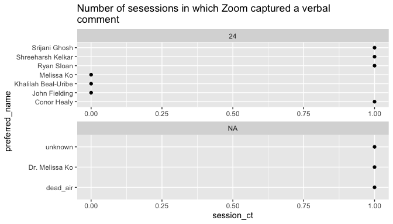

``` r
plot_users_by_metric(transcripts_summary_df, metric = 'n')
#> Warning: Removed 3 rows containing missing values (`geom_point()`).
```

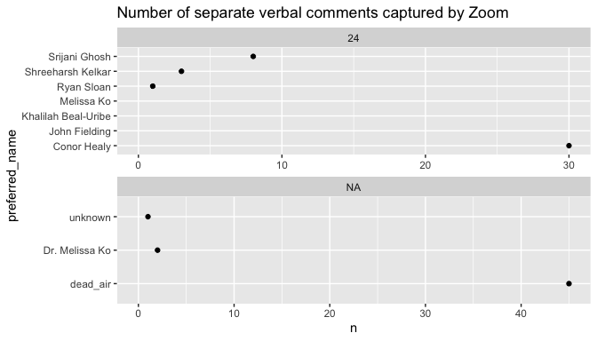

``` r
plot_users_by_metric(transcripts_summary_df, metric = 'perc_n')
#> Warning: Removed 3 rows containing missing values (`geom_point()`).
```

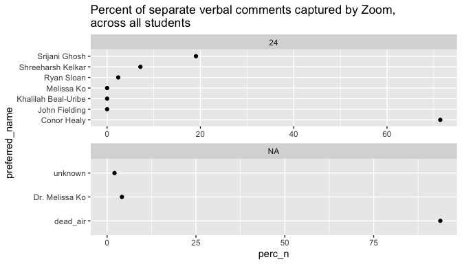

``` r
plot_users_by_metric(transcripts_summary_df, metric = 'duration')
#> Warning: Removed 3 rows containing missing values (`geom_point()`).
```

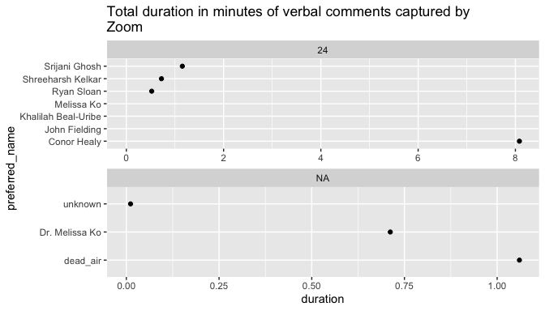

``` r
plot_users_by_metric(transcripts_summary_df, metric = 'perc_duration')
#> Warning: Removed 3 rows containing missing values (`geom_point()`).
```


``` r
plot_users_by_metric(transcripts_summary_df, metric = 'wordcount')
#> Warning: Removed 3 rows containing missing values (`geom_point()`).
```

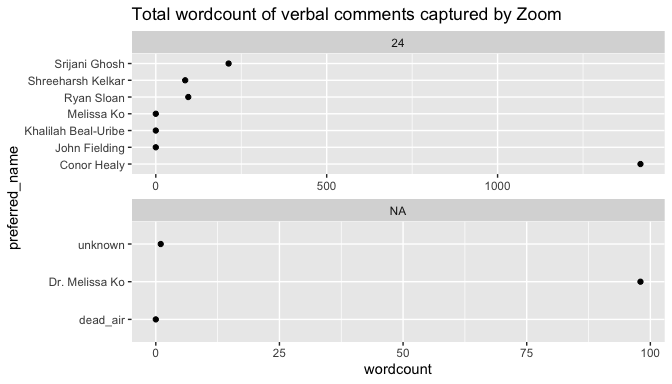

``` r
plot_users_by_metric(transcripts_summary_df, metric = 'perc_wordcount')
#> Warning: Removed 3 rows containing missing values (`geom_point()`).
```

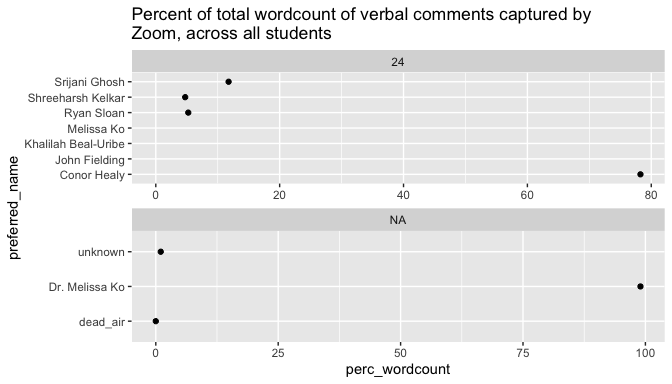

``` r
plot_users_by_metric(transcripts_summary_df, metric = 'wpm')
#> Warning: Removed 3 rows containing missing values (`geom_point()`).
```

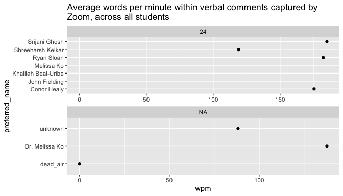

# Students Only

## 1. Make Transcripts Summary

1.  Run `make_students_only_transcripts_summary_df()` to filter for only
    the students enrolled in the class and get a tibble from summary
    results at the level of the class section and preferred student name
    for those enrolled students.

``` r
students_only_transcripts_summary_df <- make_students_only_transcripts_summary_df(
  transcripts_session_summary_df)

students_only_transcripts_summary_df
#> # A tibble: 7 × 10
#>   section preferred_name      session_ct     n duration wordcount   wpm perc_n
#>     <dbl> <chr>                    <int> <int>    <dbl>     <dbl> <dbl>  <dbl>
#> 1      24 Conor Healy                  1    30    8.08       1418  175.  71.4 
#> 2      24 Srijani Ghosh                1     8    1.15        213  185.  19.0 
#> 3      24 Shreeharsh Kelkar            1     3    0.722        86  119.   7.14
#> 4      24 Ryan Sloan                   1     1    0.521        95  182.   2.38
#> 5      24 John Fielding                0    NA   NA            NA   NA   NA   
#> 6      24 Khalilah Beal-Uribe          0    NA   NA            NA   NA   NA   
#> 7      24 Melissa Ko                   0    NA   NA            NA   NA   NA   
#> # ℹ 2 more variables: perc_duration <dbl>, perc_wordcount <dbl>
```

## 2. Plot Students by key metrics

1.  Run `plot_users_by_metric()` for the key metrics to output said
    plots.

``` r
plot_users_by_metric(students_only_transcripts_summary_df,
                     metric = 'session_ct')
```

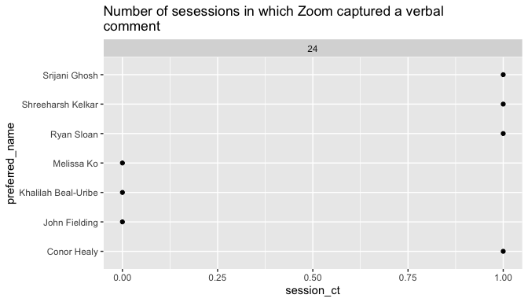

``` r
plot_users_by_metric(students_only_transcripts_summary_df,
                     metric = 'n')
#> Warning: Removed 3 rows containing missing values (`geom_point()`).
```

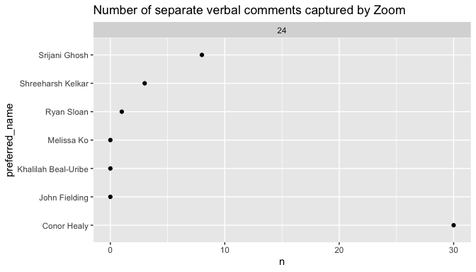

``` r
plot_users_by_metric(students_only_transcripts_summary_df,
                     metric = 'perc_n')
#> Warning: Removed 3 rows containing missing values (`geom_point()`).
```

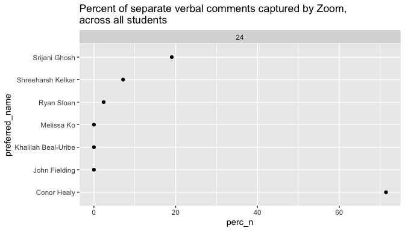

``` r
plot_users_by_metric(students_only_transcripts_summary_df,
                     metric = 'duration')
#> Warning: Removed 3 rows containing missing values (`geom_point()`).
```

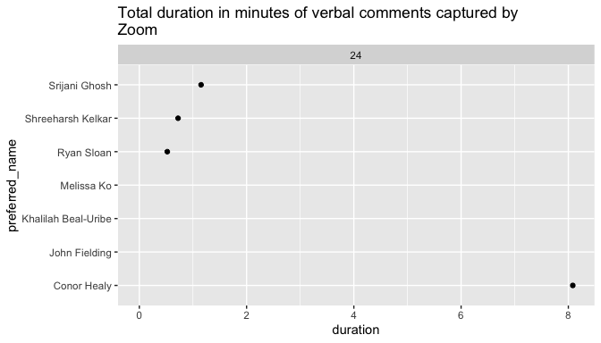

``` r
plot_users_by_metric(students_only_transcripts_summary_df,
                     metric = 'perc_duration')
#> Warning: Removed 3 rows containing missing values (`geom_point()`).
```

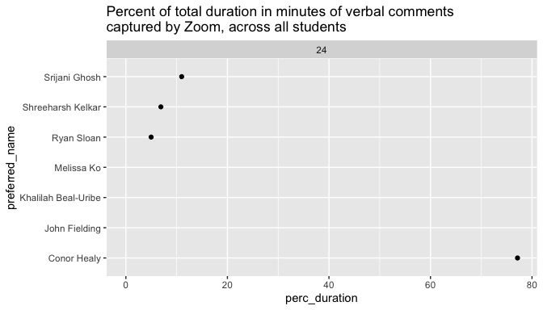

``` r
plot_users_by_metric(students_only_transcripts_summary_df,
                     metric = 'wordcount')
#> Warning: Removed 3 rows containing missing values (`geom_point()`).
```

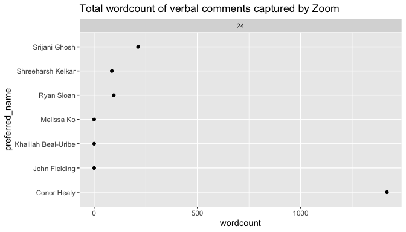

``` r
plot_users_by_metric(students_only_transcripts_summary_df,
                     metric = 'perc_wordcount')
#> Warning: Removed 3 rows containing missing values (`geom_point()`).
```

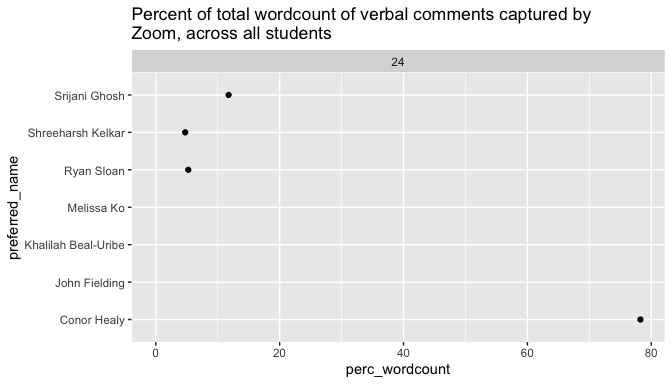

``` r
plot_users_by_metric(students_only_transcripts_summary_df,
                     metric = 'wpm')
#> Warning: Removed 3 rows containing missing values (`geom_point()`).
```

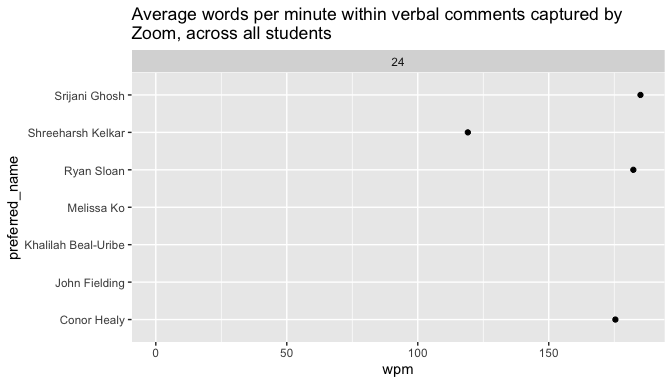

## 3. Plot Students with names masked by key metrics

1.  Run `plot_users_masked_section_by_metric()` for the key metrics to
    output said plots, but with student names masked by “Student \_“.

``` r
plot_users_masked_section_by_metric(df = students_only_transcripts_summary_df, 
                                    metric = 'session_ct')
```

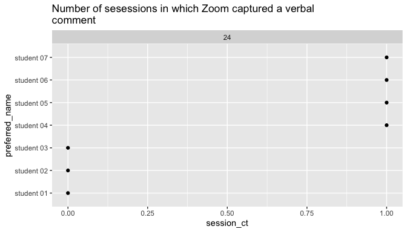

``` r
plot_users_masked_section_by_metric(df = students_only_transcripts_summary_df,
                                    metric = 'n')
#> Warning: Removed 3 rows containing missing values (`geom_point()`).
```

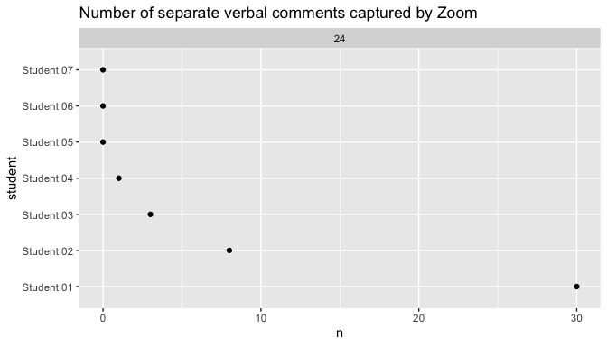

``` r
plot_users_masked_section_by_metric(df = students_only_transcripts_summary_df,
                                    metric = 'perc_n')
#> Warning: Removed 3 rows containing missing values (`geom_point()`).
```

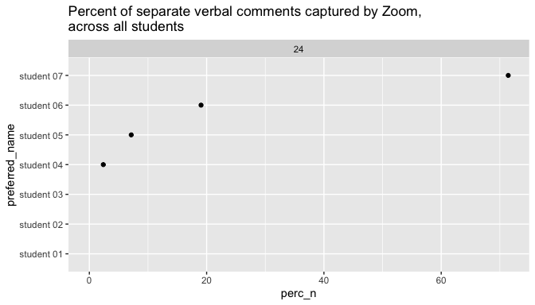

``` r
plot_users_masked_section_by_metric(df = students_only_transcripts_summary_df,
                                    metric = 'duration')
#> Warning: Removed 3 rows containing missing values (`geom_point()`).
```

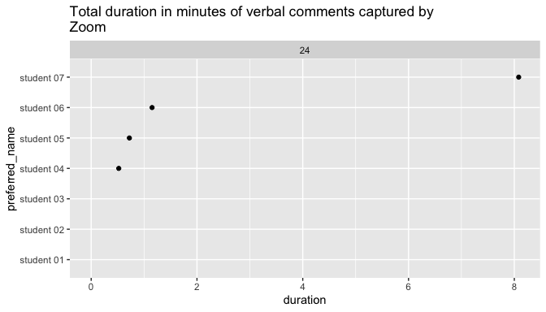

``` r
plot_users_masked_section_by_metric(df = students_only_transcripts_summary_df,
                                    metric = 'perc_duration')
#> Warning: Removed 3 rows containing missing values (`geom_point()`).
```

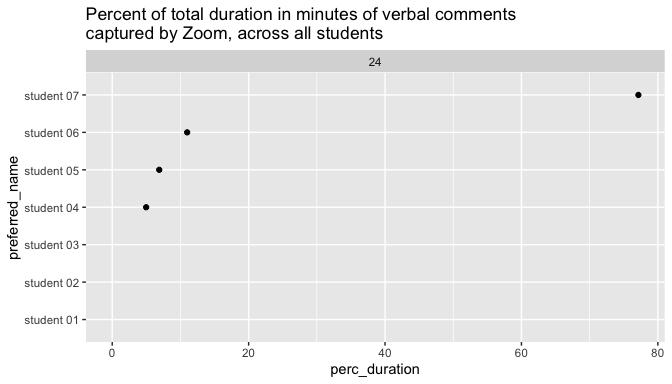

``` r
plot_users_masked_section_by_metric(df = students_only_transcripts_summary_df,
                                    metric = 'wordcount')
#> Warning: Removed 3 rows containing missing values (`geom_point()`).
```

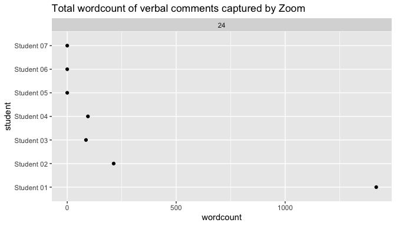

``` r
plot_users_masked_section_by_metric(df = students_only_transcripts_summary_df,
                                    metric = 'perc_wordcount')
#> Warning: Removed 3 rows containing missing values (`geom_point()`).
```

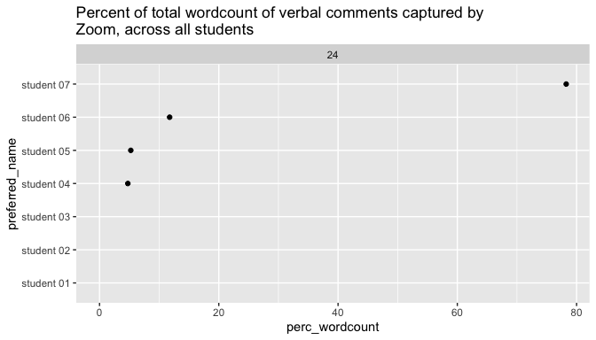

``` r
plot_users_masked_section_by_metric(df = students_only_transcripts_summary_df,
                                    metric = 'wpm')
#> Warning: Removed 3 rows containing missing values (`geom_point()`).
```

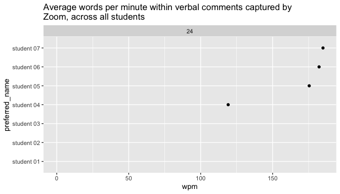

# Student Reports

## 1. Make Transcripts Summary

1.  Run `run_student_reports()` to filter for only the students enrolled
    in the class and get a tibble from summary results at the level of
    the class section and preferred student name for those enrolled
    students.

## run_student_reports()

``` r


run_student_reports <-
  function(df_sections = sections_df,
           df_roster = roster_df,
           data_folder = 'data',
           transcripts_session_summary_file = 'transcripts_session_summary.csv',
           transcripts_summary_file = 'transcripts_summary.csv',
           student_summary_report =
             'Zoom Student Engagement Analysis - student summary report')
  {
    student_summary_report_rmd <-
      paste0(student_summary_report, '.Rmd')
    
    for (section in df_sections$section) {
      print(section)
      
      target_section <- section
      
      target_students <- df_roster %>%
        filter(section == target_section) %>%
        .$preferred_name %>%
        c('All Students', .)
      
      # target_student <- 'All Students'
      
      for (target_student in target_students) {
        print(target_student)
        
        student_summary_report_output_file <-
          paste0(
            data_folder,
            '/',
            student_summary_report,
            ' - section ',
            target_section,
            ' - ',
            target_student,
            '.pdf'
          )
        
        
        rmarkdown::render(
          student_summary_report_rmd,
          params = list(
            target_section = target_section,
            target_student = target_student,
            data_folder = data_folder,
            transcripts_session_summary_file = transcripts_session_summary_file,
            transcripts_summary_file = transcripts_summary_file
          ),
          output_file = student_summary_report_output_file
        )
        print(student_summary_report_output_file)
        
      }
      
    }
  }
```

### Run run_student_reports()

``` r
# run_student_reports(
#   df_sections = sections_df,
#   df_roster = roster_df,
#   data_folder = data_folder_input,
#   transcripts_session_summary_file = transcripts_session_summary_file_input,
#   transcripts_summary_file = transcripts_summary_file_input,
#   student_summary_report = student_summary_report_input
#   
# ) 
```

# `fliwc()` a single transcript file:

## 1. fliwc()

1.  Run `fliwc()` to process a Zoom recording transcript and return
    summary metrics by speaker.

``` r

recording_transcript_file_path <-
  paste0(
    data_folder_input,
    '/',
    transcripts_folder_input,
    '/',
    'GMT20240124-202901_Recording.transcript.vtt'
  )


fliwc_transcript_df2 <- fliwc(
  transcript_file_path = recording_transcript_file_path,
  names_exclude = c("dead_air"),
  # consolidate_comments = TRUE,
  # max_pause_sec = 1,
  # add_dead_air = TRUE,
  # dead_air_name = 'dead_air',
  # na_name = 'unknown',
  # transcript_df = processed_zoom_transcript_df
)
#> Rows: 306 Columns: 1
#> ── Column specification ────────────────────────────────────────────────────────
#> Delimiter: "\t"
#> chr (1): WEBVTT
#> 
#> ℹ Use `spec()` to retrieve the full column specification for this data.
#> ℹ Specify the column types or set `show_col_types = FALSE` to quiet this message.

fliwc_transcript_df2
#> # A tibble: 6 × 9
#>   name         n duration wordcount comments n_perc duration_perc wordcount_perc
#>   <chr>    <int>    <dbl>     <dbl> <list>    <dbl>         <dbl>          <dbl>
#> 1 Conor H…    30   8.08        1418 <chr>     66.7         72.2          74.2   
#> 2 Srijani…     8   1.15         213 <chr>     17.8         10.3          11.1   
#> 3 Shreeha…     3   0.722         86 <chr>      6.67         6.45          4.50  
#> 4 Dr. Mel…     2   0.712         98 <chr>      4.44         6.36          5.13  
#> 5 Ryan Sl…     1   0.521         95 <chr>      2.22         4.65          4.97  
#> 6 unknown      1   0.0113         1 <chr>      2.22         0.101         0.0523
#> # ℹ 1 more variable: wpm <dbl>
```

# Walkthrough of key steps in `fliwc()`

## 1. load_zoom_transcript()

1.  Run `load_zoom_transcript()` to get a tibble containing the comments
    from a provided Zoom recording transcript.

``` r
single_zoom_transcript_df <- load_zoom_transcript(
  transcript_file_path = paste0(
    data_folder_input,
    '/',
    transcripts_folder_input,
    '/',
    'GMT20240124-202901_Recording.transcript.vtt'
  )
)
#> Rows: 306 Columns: 1
#> ── Column specification ────────────────────────────────────────────────────────
#> Delimiter: "\t"
#> chr (1): WEBVTT
#> 
#> ℹ Use `spec()` to retrieve the full column specification for this data.
#> ℹ Specify the column types or set `show_col_types = FALSE` to quiet this message.

single_zoom_transcript_df
#> # A tibble: 102 × 9
#>    comment_num name      comment start     end        duration raw_start raw_end
#>    <chr>       <chr>     <chr>   <time>    <time>     <drtn>   <chr>     <chr>  
#>  1 1           Srijani … Hi!     00'00.05" 00'01.790"  1.740 … 00:00:00… 00:00:…
#>  2 2           Conor He… Get th… 00'02.07" 00'04.050"  1.980 … 00:00:02… 00:00:…
#>  3 3           Srijani … Hello!… 00'05.14" 00'08.310"  3.170 … 00:00:05… 00:00:…
#>  4 4           Srijani … So      00'09.71" 00'11.670"  1.960 … 00:00:09… 00:00:…
#>  5 5           Conor He… let's … 00'12.16" 00'14.309"  2.149 … 00:00:12… 00:00:…
#>  6 6           Conor He… Studen… 00'14.55" 00'30.599" 16.049 … 00:00:14… 00:00:…
#>  7 7           Conor He… that.   00'31.44" 00'32.390"  0.950 … 00:00:31… 00:00:…
#>  8 8           Dr. Meli… and I'… 00'32.52" 00'43.089" 10.569 … 00:00:32… 00:00:…
#>  9 9           Dr. Meli… Can yo… 00'43.50" 00'51.110"  7.610 … 00:00:43… 00:00:…
#> 10 10          Dr. Meli… yeah, … 00'51.13" 00'58.459"  7.329 … 00:00:51… 00:00:…
#> # ℹ 92 more rows
#> # ℹ 1 more variable: wordcount <int>
```

## 2. process_zoom_transcript()

1.  Run `process_zoom_transcript()` with given parameters to get a
    tibble containing the comments from a Zoom recording transcript.

``` r
processed_zoom_transcript_df <- process_zoom_transcript(
  # transcript_file_path = NULL,
  # consolidate_comments = TRUE,
  # max_pause_sec = 1,
  # add_dead_air = TRUE,
  # dead_air_name = 'dead_air',
  # na_name = 'unknown',
  transcript_df = single_zoom_transcript_df
)

processed_zoom_transcript_df
#> # A tibble: 90 × 9
#>    comment_num name       comment start     end       duration wordcount raw_end
#>          <int> <chr>      <chr>   <time>    <time>    <drtn>       <int> <lgl>  
#>  1           1 dead_air   <NA>    00'00.00" 00'00.05"  0.0499…        NA NA     
#>  2           2 Srijani G… Hi!     00'00.05" 00'01.79"  1.7400…         1 NA     
#>  3           3 dead_air   <NA>    00'01.79" 00'02.07"  0.2799…        NA NA     
#>  4           4 Conor Hea… Get th… 00'02.07" 00'04.05"  1.9800…         4 NA     
#>  5           5 dead_air   <NA>    00'04.05" 00'05.14"  1.0900…        NA NA     
#>  6           6 Srijani G… Hello!… 00'05.14" 00'08.31"  3.1699…         8 NA     
#>  7           7 dead_air   <NA>    00'08.31" 00'09.71"  1.4000…        NA NA     
#>  8           8 Srijani G… So      00'09.71" 00'11.67"  1.9600…         1 NA     
#>  9           9 dead_air   <NA>    00'11.67" 00'12.16"  0.4900…        NA NA     
#> 10          10 Conor Hea… let's … 00'12.16" 00'32.39" 20.2300…        38 NA     
#> # ℹ 80 more rows
#> # ℹ 1 more variable: raw_start <lgl>
```

## 3. fliwc()

1.  Run `fliwc()` to process a Zoom recording transcript and return
    summary metrics by speaker.

``` r
fliwc_transcript_df <- fliwc(
  # transcript_file_path = '',
  names_exclude = c("dead_air"),
  # consolidate_comments = TRUE,
  # max_pause_sec = 1,
  # add_dead_air = TRUE,
  # dead_air_name = 'dead_air',
  # na_name = 'unknown',
  transcript_df = processed_zoom_transcript_df
)

fliwc_transcript_df
#> # A tibble: 6 × 9
#>   name         n duration wordcount comments n_perc duration_perc wordcount_perc
#>   <chr>    <int>    <dbl>     <dbl> <list>    <dbl>         <dbl>          <dbl>
#> 1 Conor H…    30   8.08        1418 <chr>     66.7         72.2          74.2   
#> 2 Srijani…     8   1.15         213 <chr>     17.8         10.3          11.1   
#> 3 Shreeha…     3   0.722         86 <chr>      6.67         6.45          4.50  
#> 4 Dr. Mel…     2   0.712         98 <chr>      4.44         6.36          5.13  
#> 5 Ryan Sl…     1   0.521         95 <chr>      2.22         4.65          4.97  
#> 6 unknown      1   0.0113         1 <chr>      2.22         0.101         0.0523
#> # ℹ 1 more variable: wpm <dbl>
```

# Steps to use zoomstudentengagement

1.  Define Inputs:
    - Current Term Inputs
      - `instructor_name_input`
      - etc
    - Other Constants
      - `names_exclude_input`
      - etc
2.  Load the zoomstudentengagement library
    - `r devtools::install_github("revgizmo/zoomstudentengagement")`
    - `r library(zoomstudentengagement)`
3.  Download the Zoom Recording Transcripts
    1.  Download Zoom csv file with list of recordings and transcripts
        1.  Go to <https://www.zoom.us/recording>
        2.  Export the Cloud Recordings
        3.  Copy the cloud recording csv (naming convention:
            ’zoomus_recordings\_\_\d{8}.csv’) to ‘data/transcripts/’
    2.  Download Transcripts
        1.  Go to <https://www.zoom.us/recording>
        2.  Click on each individual record to go to the page for that
            recording
        3.  Download the Audio Transcript and Chat File for each
            - Chat: ’GMT\d{8}-\d{6}\_Recording.cc.vtt’
            - Transcript: ’GMT\d{8}-\d{6}\_Recording.transcript.vtt’
        4.  Copy the Audio Transcript and Chat Files to
            ‘data/transcripts/’
4.  Load the list of Zoom Recordings Transcripts
    1.  Run `load_zoom_recorded_sessions_list()` to get a tibble from a
        provided csv file of Zoom recordings.

``` r

load_zoom_recorded_sessions_list(data_folder = system.file("extdata",  package="zoomstudentengagement")
)
#> Rows: 4 Columns: 9
#> ── Column specification ────────────────────────────────────────────────────────
#> Delimiter: ","
#> chr (4): Topic, ID, Start Time, Last Accessed
#> dbl (4): File Size (MB), File Count, Total Views, Total Downloads
#> 
#> ℹ Use `spec()` to retrieve the full column specification for this data.
#> ℹ Specify the column types or set `show_col_types = FALSE` to quiet this message.
#> # A tibble: 3 × 15
#> # Groups:   Topic, ID, Start Time, File Size (MB) [3]
#>   Topic           ID    `Start Time` `File Size (MB)` `File Count` `Total Views`
#>   <chr>           <chr> <chr>                   <dbl>        <dbl>         <dbl>
#> 1 LTF 23.24 - Th… 960 … Jan 11, 202…            2317.           36             0
#> 2 LTF 23.24 - Th… 960 … Jan 18, 202…            1201.           24             0
#> 3 LTF 23.24 - Th… 996 … Jan 24, 202…             147.           11             0
#> # ℹ 9 more variables: `Total Downloads` <dbl>, `Last Accessed` <chr>,
#> #   dept <chr>, section <chr>, day <chr>, time <chr>, instructor <chr>,
#> #   match_start_time <dttm>, match_end_time <dttm>
```

    2. Run `load_transcript_files_list()` to get a data.table from a provided folder including transcript files of Zoom recordings.
    3. Update / Make Cancelled Classes CSV
        1. If you have an existing "cancelled_classes.csv", update it as necessary, or
        2. Run `make_blank_cancelled_classes_df()` and save it as a .csv file.
    4. Run `join_transcripts_list()` to get a tibble from the joining of the listing of session recordings loaded from the cloud recording csvs ('df_zoom_recorded_sessions'), the list of transcript files ('df_transcript_files'), and the list of cancelled classes ('df_cancelled_classes') into a single tibble.

5.  Load Zoom Transcript files and Run Faculty Linguistic Inquiry and
    Word Count on those sessions.
    1.  Run `fliwc_transcript_files()`.

# Old

What is special about using `README.Rmd` instead of just `README.md`?
You can include R chunks like so:

``` r
summary(cars)
#>      speed           dist       
#>  Min.   : 4.0   Min.   :  2.00  
#>  1st Qu.:12.0   1st Qu.: 26.00  
#>  Median :15.0   Median : 36.00  
#>  Mean   :15.4   Mean   : 42.98  
#>  3rd Qu.:19.0   3rd Qu.: 56.00  
#>  Max.   :25.0   Max.   :120.00
```

You’ll still need to render `README.Rmd` regularly, to keep `README.md`
up-to-date. `devtools::build_readme()` is handy for this.

You can also embed plots, for example:


In that case, don’t forget to commit and push the resulting figure
files, so they display on GitHub and CRAN.
